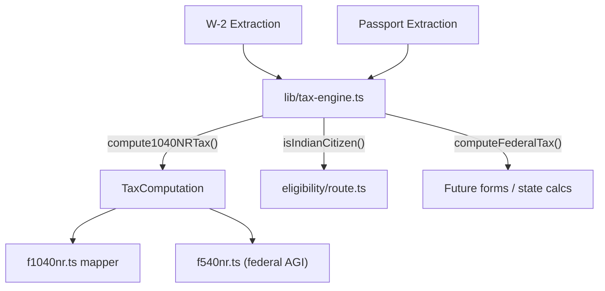

# Build Centralized Tax Calculation Engine

## Context

Tax calculation logic is currently scattered:

- Income math and deduction logic live inline in `[lib/form-mappers/f1040nr.ts](lib/form-mappers/f1040nr.ts)` (lines 103-151)
- `isIndianCitizen()` is duplicated in `[app/api/forms/eligibility/route.ts](app/api/forms/eligibility/route.ts)` (lines 12-28) and inline in `f1040nr.ts` (lines 141-143)
- `[lib/form-mappers/f540nr.ts](lib/form-mappers/f540nr.ts)` uses raw W-2 wages as federal AGI (line 98) instead of the computed AGI
- No federal tax (Line 16), total tax (Line 24), overpayment/refund/amount owed are calculated

## New File: `[lib/tax-engine.ts](lib/tax-engine.ts)`

A pure computation module with zero DB/API dependencies. Takes extracted document data, returns computed values.

### 1. Types

```typescript
type TaxBracket = { min: number; max: number; rate: number };

type TaxComputation = {
  wages: number;              // Line 1a
  ssTips: number;             // Line 1c
  depCare: number;            // Line 1e
  allocatedTips: number;      // Line 1h
  totalWages: number;         // Line 1z
  otherIncome: number;        // Line 8
  totalIncome: number;        // Line 9 (total ECI)
  agi: number;                // Line 11a/11b
  isIndianNational: boolean;
  standardDeduction: number;  // Line 12 (0 if not eligible)
  totalDeductions: number;    // Line 14
  taxableIncome: number;      // Line 15
  tax: number;                // Line 16
  totalTax: number;           // Line 24
  federalWithheld: number;    // Line 25a
  totalPayments: number;      // Line 33
  overpayment: number;        // Line 34 (payments > tax ? diff : 0)
  refund: number;             // Line 35a (same as overpayment)
  amountOwed: number;         // Line 37 (tax > payments ? diff : 0)
};
```

### 2. 2025 Federal Brackets (Single)

```typescript
const FEDERAL_BRACKETS_2025_SINGLE: TaxBracket[] = [
  { min: 0,      max: 11925,    rate: 0.10 },
  { min: 11925,  max: 48475,    rate: 0.12 },
  { min: 48475,  max: 103350,   rate: 0.22 },
  { min: 103350, max: 197300,   rate: 0.24 },
  { min: 197300, max: 250525,   rate: 0.32 },
  { min: 250525, max: 626350,   rate: 0.35 },
  { min: 626350, max: Infinity, rate: 0.37 },
];
```

### 3. Core Functions

- `**computeFederalTax(taxableIncome: number, brackets: TaxBracket[]): number**` -- Progressive bracket math. Iterates brackets, accumulates `(min(income, bracket.max) - bracket.min) * rate` for each applicable bracket. Rounds to nearest cent.
- `**isIndianCitizen(passport: PassportExtraction | null): boolean**` -- Checks `nationality`, `country_code`, `issuing_country` against a set of Indian identifiers (`india`, `indian`, `ind`, `in`). Case-insensitive.
- `**getStandardDeduction(taxYear: number, isIndianNational: boolean): number**` -- Returns `$15,750` for 2025+ single Indian nationals (US-India tax treaty Art. 21(2)), `$14,600` for 2024, `0` for non-Indian nationals.
- `**getBracketsForYear(taxYear: number): TaxBracket[]**` -- Returns the correct bracket table for the given year. For now, only 2025 brackets exist; throws or falls back for unsupported years.
- `**compute1040NRTax(docs: FormDocuments): TaxComputation**` -- Top-level orchestrator: extracts W-2 fields, determines nationality, calculates income/deduction/tax/payments/refund.

All functions are exported individually for reuse by any form mapper or future engine.

## Integration Changes

### `[lib/form-mappers/f1040nr.ts](lib/form-mappers/f1040nr.ts)`

- Import `compute1040NRTax` from `lib/tax-engine`
- Replace inline income/deduction math (lines 103-151) with a call to `compute1040NRTax(docs)`
- Use the returned `TaxComputation` to populate all existing fields **plus** the currently-missing Page 2 tax lines:
  - `f2_09` -- Line 16: Tax from brackets
  - `f2_11` -- Line 18: Tax (Line 16 + 17, same as Line 16 when no Schedule D)
  - `f2_15` -- Line 22: Line 18 minus credits (same as Line 18 for basic case)
  - `f2_20` -- Line 24: Total tax
  - `f2_36` -- Line 34: Overpayment
  - `f2_37` -- Line 35a: Refund
  - `f2_42` -- Line 37: Amount owed

### `[lib/form-mappers/f540nr.ts](lib/form-mappers/f540nr.ts)`

- Import `compute1040NRTax` from `lib/tax-engine`
- Replace raw `w2?.wages_tips_other` on line 98 with `computation.agi` so federal AGI (field `2001`) reflects the proper computed value

### `[app/api/forms/eligibility/route.ts](app/api/forms/eligibility/route.ts)`

- Import `isIndianCitizen` from `lib/tax-engine` instead of defining it locally
- Adapt the call (currently takes `StoredDocumentPassport`, engine version takes `PassportExtraction`; pass `doc.data` instead of `doc`)

## Data Flow




## Design Notes

- The engine is a **pure module** -- no database access, no HTTP, no side effects. It receives data and returns computations.
- Bracket tables are stored as typed constants, making it straightforward to add 2026+ brackets or other filing statuses (MFJ, HoH) later.
- `compute1040NRTax` is specific to the 1040NR flow (single NRA filer), but the lower-level `computeFederalTax` and `getStandardDeduction` are generic and reusable for any form.

