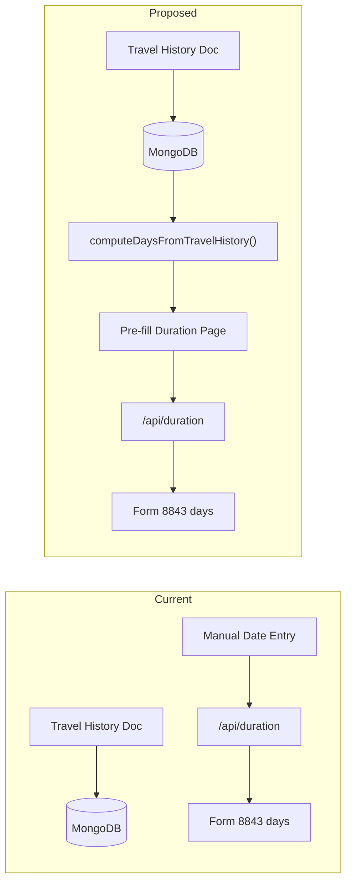

# Auto-compute Duration of Stay from Travel History

## Current State

- The **duration page** (`app/(app)/duration/page.tsx`) requires users to manually enter one arrival and one departure date per year (2023, 2024, 2025).
- The **travel history document** (uploaded as `travel-history`) contains all I-94 entry/exit records, each with `date`, `type` ("Arrival" / "Departure"), and `location`.
- These two data sources are currently disconnected -- users re-enter data they've already uploaded.

## Data Flow (Current vs Proposed)




## Algorithm: Computing Days per Year

Given travel history records sorted chronologically:

1. **Pair** each Arrival with the next chronological Departure (an unpaired Arrival with no subsequent Departure is treated as "still in the US" -- cap at Dec 31 of the year or today's date).
2. **For each pair**, compute the overlap with each target year:
  - If arrival is 2024-11-01 and departure is 2025-03-15:
    - 2024 days = Nov 1 to Dec 31 = 62 days
    - 2025 days = Jan 1 to Mar 15 = 74 days
3. **Sum** all overlapping days per year across all pairs.
4. **Also track** the earliest arrival and latest departure per year (needed for the existing `DurationEntry` model).

## Changes

### 1. New utility: `lib/duration-calculator.ts`

Create a pure function:

```typescript
type TravelRecord = { date: string; type: string; location: string };
type YearSummary = { 
  year: number; 
  totalDays: number;
  arrival: string;   // earliest arrival in this year
  departure: string; // latest departure in this year
  trips: { arrival: string; departure: string; days: number }[];
};

function computeDaysFromTravelHistory(
  records: TravelRecord[], 
  years: number[]
): YearSummary[]
```

- Sorts records by date ascending
- Pairs Arrivals with next Departures
- Computes per-year overlap for each pair
- Returns a summary per year including total days, first arrival, last departure, and individual trip breakdowns

### 2. Update `GET /api/duration` ([app/api/duration/route.ts](app/api/duration/route.ts))

In addition to returning saved `entries`, also:

- Fetch the user's `travel-history` document from MongoDB
- Run `computeDaysFromTravelHistory()` on the records
- Return both `entries` (manual) and `computed` (from travel history) in the response

```typescript
// Response shape:
{ 
  entries: DurationEntry[], 
  computed: YearSummary[] | null  // null if no travel history uploaded
}
```

### 3. Update the duration page ([app/(app)/duration/page.tsx](app/(app)/duration/page.tsx))

- On load, if `computed` data is returned from the API and no manual `entries` exist yet, auto-fill the arrival/departure fields from the computed data.
- Display the total computed days per year (from travel history) alongside each year card, showing the trip breakdown (e.g., "3 trips, 245 total days").
- Replace the "Fill" (random) button with a "Compute from Travel History" button that re-applies the computed values.
- Keep the manual date inputs so users can override if needed, but visually distinguish auto-filled vs. manually entered values.
- Show an info message if no travel history document is uploaded, prompting the user to upload one for auto-fill.

### 4. Update `daysForYear` in form mappers ([lib/form-mappers/types.ts](lib/form-mappers/types.ts))

Currently `daysForYear()` computes days from a single arrival/departure range per year. This can overcount if there are gaps. Once we store actual computed `totalDays`, we should prefer that value. Two options:

- **Option A (simpler)**: Keep `DurationEntry` as is. The auto-filled arrival = first arrival of year, departure = last departure of year. Accept this may slightly overcount for multi-trip years (uncommon for F-1 students).
- **Option B (accurate)**: Add an optional `totalDays` field to `DurationEntry`. When present, `daysForYear()` returns it directly instead of computing from the date range.

**Recommendation**: Option A for now (simpler, correct for 95%+ of F-1 cases). The travel history pairing in the 1040-NR mapper already handles the detailed trip table separately.

## Files to Modify

- **Create**: `lib/duration-calculator.ts` -- pure computation utility
- **Modify**: [app/api/duration/route.ts](app/api/duration/route.ts) -- add travel history lookup and computed data to GET response
- **Modify**: [app/(app)/duration/page.tsx](app/(app)/duration/page.tsx) -- auto-fill from computed data, show trip breakdown, replace "Fill" button

