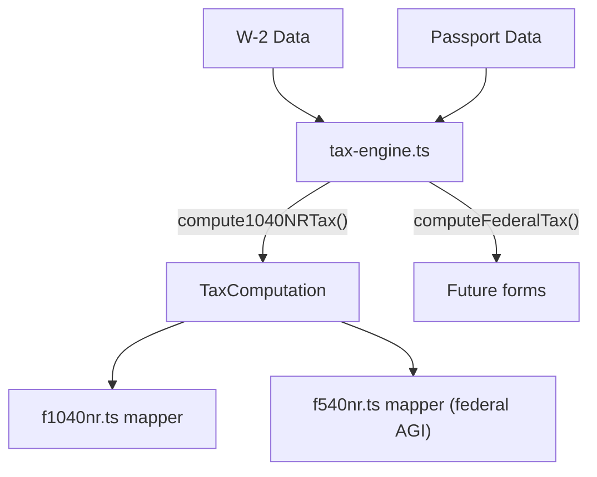

# Fix 1040NR Field Mapping + Tax Calculation Engine

## Part 1: Fix Field Mapping Bugs

The mapper in [lib/form-mappers/f1040nr.ts](lib/form-mappers/f1040nr.ts) maps data to **wrong PDF AcroForm field IDs**. Comparing against the field reference in [scripts/add-1040nr-field-names.mjs](scripts/add-1040nr-field-names.mjs):

```
Form Line  | What               | WRONG field (current)     | CORRECT field
-----------|--------------------|---------------------------|---------------------------
1h amount  | Allocated tips $   | P1.f1_49 (1h type)        | P1.f1_50 (1h amount)
8          | Other income       | P1.f1_63 (Line 5b)        | P1.f1_68 (Line 8)
9          | Total ECI          | P1.f1_64 (Line 5c)        | P1.f1_69 (Line 9)
11a        | AGI                | P1.f1_66 (Line 7a)        | P1.f1_71 (Line 11a)
11b        | AGI (Page 2)       | (not mapped)              | P2.f2_01 (Line 11b)
12         | Std deduction      | P1.f1_67 (Line 7b)        | P2.f2_02 (Line 12)
14         | Total deductions   | P1.f1_70 (Line 10)        | P2.f2_06 (Line 14)
15         | Taxable income     | P1.f1_71 (Line 11a)       | P2.f2_07 (Line 15)
```

All fixes are in [lib/form-mappers/f1040nr.ts](lib/form-mappers/f1040nr.ts) lines ~107-148.

## Part 2: Tax Calculation Engine

### New file: `lib/tax-engine.ts`

A centralized module reusable by 1040NR, 540NR, and future form mappers.

### Contents

**1. 2025 Federal Tax Brackets (Single)**

```typescript
const FEDERAL_BRACKETS_2025_SINGLE = [
  { min: 0,       max: 11925,   rate: 0.10 },
  { min: 11925,   max: 48475,   rate: 0.12 },
  { min: 48475,   max: 103350,  rate: 0.22 },
  { min: 103350,  max: 197300,  rate: 0.24 },
  { min: 197300,  max: 250525,  rate: 0.32 },
  { min: 250525,  max: 626350,  rate: 0.35 },
  { min: 626350,  max: Infinity, rate: 0.37 },
];
```

**2. `computeFederalTax(taxableIncome, brackets)`** -- Progressive bracket math. Iterates brackets, sums `(min(income, max) - min) * rate` for each.

**3. `isIndianCitizen(passport)`** -- Extracted from [app/api/forms/eligibility/route.ts](app/api/forms/eligibility/route.ts) (lines 12-28) into a shared utility. Checks `nationality`, `country_code`, `issuing_country` against `["india","indian","ind","in"]`.

**4. `getStandardDeduction(taxYear, isIndianNational)`** -- NRAs generally cannot claim the standard deduction. Exception: Indian nationals under US-India tax treaty Article 21. Returns `$15,000` for 2025 single Indian nationals, `0` for others.

**5. `compute1040NRTax(docs: FormDocuments)`** -- Top-level function that returns all computed values:

```typescript
type TaxComputation = {
  wages: number;              // Line 1a
  totalWages: number;         // Line 1z
  totalIncome: number;        // Line 9
  agi: number;                // Line 11a/11b
  standardDeduction: number;  // Line 12 (0 if not eligible)
  totalDeductions: number;    // Line 14
  taxableIncome: number;      // Line 15
  tax: number;                // Line 16
  totalTax: number;           // Line 24
  federalWithheld: number;    // Line 25a
  totalPayments: number;      // Line 33
  overpayment: number;        // Line 34 (if payments > tax)
  amountOwed: number;         // Line 37 (if tax > payments)
  refund: number;             // Line 35a
  isIndianNational: boolean;
};
```

### Data flow



### Integration with mappers

**f1040nr.ts**: Replace inline income/deduction math with `compute1040NRTax(docs)`. Use the returned `TaxComputation` to populate all lines including the currently-missing Page 2 tax lines:

- Line 16 (`f2_09`): Tax amount from brackets
- Line 18 (`f2_11`): Lines 16 + 17
- Line 22 (`f2_15`): Line 18 - Line 21
- Line 24 (`f2_20`): Total tax
- Line 34 (`f2_36`): Overpayment (if any)
- Line 35a (`f2_37`): Refund amount
- Line 37 (`f2_42`): Amount owed (if any)

**f540nr.ts**: Import `compute1040NRTax` to get the federal AGI for field `2001` instead of using raw `wages_tips_other`.

**eligibility/route.ts**: Import `isIndianCitizen` from `lib/tax-engine.ts` instead of defining it locally.
