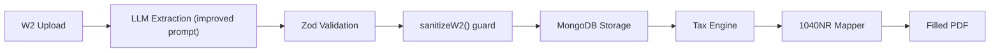

# Fix W-2 Box 12a Code DD Leaking Into 1040NR

## Problem

During W-2 extraction, the LLM sometimes misreads Box 12a (Code DD -- employer health coverage cost, not reported on any tax form) and places its dollar amount into adjacent fields like `dependent_care_benefits` (Box 10) or `nonqualified_plans` (Box 11). The tax engine and 1040NR mapper then deterministically use those fields for Lines 1e/8, so the DD amount incorrectly appears on the filled form. The behavior is inconsistent because LLM extraction is non-deterministic.

## Two-Layer Fix

### Layer 1: Improve the W-2 extraction prompt

**File:** [extraction/prompts/forms/w2.ts](extraction/prompts/forms/w2.ts) (line 65, `w2Prompt`)

Add explicit instructions to the prompt:

- Warn that Box 10 and Box 12 are physically adjacent on the W-2 and must not be confused
- State that Box 12 entries (which always have a letter code like D, DD, W) must **only** go in the `box_12` array
- State that `dependent_care_benefits` must only contain the value printed in Box 10, not any Box 12 value
- If Box 10 is empty on the form, `dependent_care_benefits` must be `""`

### Layer 2: Post-extraction sanitization guard

**File:** [extraction/prompts/forms/w2.ts](extraction/prompts/forms/w2.ts) (new export: `sanitizeW2`)

Add a `sanitizeW2(data: W2Extraction): W2Extraction` function that runs after extraction and Zod validation. It cross-references `box_12` entries against `dependent_care_benefits` and `nonqualified_plans`:

- If `dependent_care_benefits` has a non-empty value that matches any `box_12[].amount`, set it to `""`
- If `nonqualified_plans` has a non-empty value that matches any `box_12[].amount`, set it to `""`

This catches cases where the LLM still misplaces the value despite the improved prompt.

**File:** [extraction/openai.ts](extraction/openai.ts) (~line 141)

After Zod validation (`result.data`), if `documentType === "w2"`, call `sanitizeW2(result.data)` before returning. This ensures all downstream consumers (tax engine, form mappers) get clean data.

## Data Flow (after fix)

## Files Changed

- [extraction/prompts/forms/w2.ts](extraction/prompts/forms/w2.ts) -- improved prompt + new `sanitizeW2` function
- [extraction/openai.ts](extraction/openai.ts) -- call `sanitizeW2` after validation for W-2 documents

