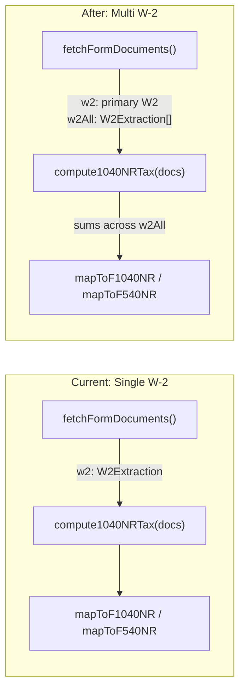

# Multi-W-2 Tax Calculation Engine

## Core Principle

W-2 fields split into two categories -- the engine only needs to change how it handles the first:

- **Summable fields** (income, withholding, tips): aggregate across ALL W-2s
- **Identity fields** (address, SSN, tax year, employer): always use the primary W-2 (index 0)

This keeps the change surgical. The tax math (brackets, deduction rules, proration) does not change at all.

## Data Flow (Before vs After)




## Changes by File (in execution order)

### 1. Add `w2All` to `FormDocuments` -- [lib/form-mappers/types.ts](lib/form-mappers/types.ts)

Add one field to `FormDocuments`:

```typescript
export type FormDocuments = {
  // ...existing fields...
  w2: W2Extraction | null;     // primary W-2 (index 0) — for address, tax year, SSN
  w2All: W2Extraction[];       // all W-2s — for income/withholding aggregation
  // ...
};
```

`w2` is kept for backward compatibility -- every mapper that reads address, tax year, or employer info continues to use `docs.w2` unchanged.

### 2. Fetch all W-2s in `fetchFormDocuments` -- [lib/form-mappers/fetch-docs.ts](lib/form-mappers/fetch-docs.ts)

Currently line 53 does `findOne({ userId, documentType: "w2" }, { sort: { w2Index: 1 } })` to get the primary W-2. Add a parallel query to fetch all W-2s:

```typescript
const [passport, i20, w2, w2AllDocs, duration, ...rest] = await Promise.all([
  // ...existing queries...
  coll.findOne({ userId, documentType: "w2" }, { sort: { w2Index: 1 } }) as Promise<StoredDocumentW2 | null>,
  coll.find({ userId, documentType: "w2" }).sort({ w2Index: 1 }).toArray() as Promise<StoredDocumentW2[]>,
  // ...rest unchanged...
]);
```

Then populate the return object:

```typescript
return {
  ok: true,
  docs: {
    // ...existing fields unchanged...
    w2: w2?.data ? sanitizeW2(w2.data) : null,
    w2All: w2AllDocs.map((d) => sanitizeW2(d.data)),
    // ...
  },
};
```

**Optimization note:** We could eliminate the separate `findOne` since `w2AllDocs[0]` is the same document. But keeping both avoids changing the existing `w2` assignment and keeps the diff minimal. A follow-up can consolidate if desired.

### 3. Update `compute1040NRTax` -- [lib/tax-engine.ts](lib/tax-engine.ts) (lines 121-177)

This is the core change. Replace single-W-2 field reads with `reduce` aggregations across `docs.w2All`:

**Before (current):**

```typescript
const wages           = parseNum(w2?.wages_tips_other);
const ssTips          = parseNum(w2?.social_security_tips);
const federalWithheld = parseNum(w2?.federal_income_tax_withheld);
// ...etc
```

**After:**

```typescript
const { passport, w2, w2All } = docs;
const taxYearNum = parseInt(w2?.tax_year ?? "2025", 10);

const wages           = sumField(w2All, "wages_tips_other");
const ssTips          = sumField(w2All, "social_security_tips");
const depCare         = sumField(w2All, "dependent_care_benefits");
const allocatedTips   = sumField(w2All, "allocated_tips");
const otherIncome     = sumField(w2All, "nonqualified_plans");
const federalWithheld = sumField(w2All, "federal_income_tax_withheld");
```

Add a small helper at the top of the file (keeps the engine DRY):

```typescript
function sumField(
  w2s: W2Extraction[],
  field: keyof W2Extraction
): number {
  return taxRound(
    w2s.reduce((sum, w) => sum + parseNum(w[field] as string), 0)
  );
}
```

Everything downstream of these six lines (totalWages, totalIncome, AGI, deductions, brackets, tax, refund/owed) is **unchanged** -- it already operates on the aggregated totals.

**Fields that stay from `w2` (primary, NOT summed):** `tax_year` (line 124). This is the only identity field the engine reads.

### 4. Update `compute540NRTax` -- [lib/tax-engine.ts](lib/tax-engine.ts) (lines 254-331)

Two changes:

**a) CA wages and withholding -- scan all W-2s:**

Replace the current single-W-2 lookup (lines 261-265):

```typescript
// Before:
const caEntry = w2?.state_local?.find(sl => sl.state.toUpperCase() === "CA");
const caWages    = parseNum(caEntry?.state_wages);
const caWithheld = parseNum(caEntry?.state_income_tax);
```

With aggregation across all W-2s:

```typescript
const { w2, w2All } = docs;

let caWages = 0;
let caWithheld = 0;
for (const w of w2All) {
  for (const sl of w.state_local ?? []) {
    if (sl.state.toUpperCase() === "CA") {
      caWages    += parseNum(sl.state_wages);
      caWithheld += parseNum(sl.state_income_tax);
    }
  }
}
caWages    = taxRound(caWages);
caWithheld = taxRound(caWithheld);
```

**b) CA SDI -- scan all W-2s' Box 14:**

Replace the current single-W-2 SDI parse (line 269):

```typescript
// Before:
const caSdi = parseCaSdi(w2?.box_14);

// After:
const caSdi = taxRound(w2All.reduce((sum, w) => sum + parseCaSdi(w.box_14), 0));
```

Everything else in the CA engine (proration, brackets, MHST, exemption credit, balance) is **unchanged**.

### 5. Form Mappers -- Minimal or No Changes

Each mapper uses `docs.w2` only for **identity fields**. Since `docs.w2` remains the primary W-2, and the engines now return correct multi-W-2 totals via the `TaxComputation` / `CA540NRComputation` objects, the mappers work without structural changes:


| Mapper                                      | W-2 usage                                                                                         | Change needed                                                   |
| ------------------------------------------- | ------------------------------------------------------------------------------------------------- | --------------------------------------------------------------- |
| [f1040nr.ts](lib/form-mappers/f1040nr.ts)   | `w2?.tax_year`, `w2?.employee.address` for header; calls `compute1040NRTax(docs)` for all numbers | **None** -- engine returns correct totals, address from primary |
| [f540nr.ts](lib/form-mappers/f540nr.ts)     | `w2?.tax_year`, `w2?.employee.address` for header; calls `compute540NRTax(docs)` for all numbers  | **None** -- same reasoning                                      |
| [f1040nro.ts](lib/form-mappers/f1040nro.ts) | `w2?.tax_year` for treaty line                                                                    | **None**                                                        |
| [f8843.ts](lib/form-mappers/f8843.ts)       | `w2?.employee.address` for US address                                                             | **None**                                                        |


### 6. SSN Route -- [app/api/user/ssn/route.ts](app/api/user/ssn/route.ts)

Already uses `findOne` to get one W-2 for SSN. Should add `sort: { w2Index: 1 }` for deterministic ordering (same as fetch-docs already does). This may have been done in the upload implementation; if not, add it.

**Current (line 31):**

```typescript
docs.findOne({ userId, documentType: "w2" }) as Promise<StoredDocumentW2 | null>,
```

**After:**

```typescript
docs.findOne({ userId, documentType: "w2" }, { sort: { w2Index: 1 } }) as Promise<StoredDocumentW2 | null>,
```

### 7. Eligibility Route -- [app/api/forms/eligibility/route.ts](app/api/forms/eligibility/route.ts)

Already updated to scan all W-2 documents (confirmed in current code, lines 31-42). **No change needed.**

## Edge Cases

- **Zero W-2s uploaded**: `w2All` is `[]`, all `reduce` calls return 0, engine produces zero-income return -- same behavior as `w2: null` today
- **Single W-2**: `w2All` has one element, `reduce` produces identical values to current single-field reads -- no behavioral change
- **Two W-2s, same state**: CA wages and withholding sum correctly across both
- **Two W-2s, different states**: Only CA entries are picked up for 540NR; non-CA state entries are ignored (correct -- other state forms not yet implemented)
- **W-2s with different tax years**: `tax_year` comes from primary W-2 (index 0). This is an edge case that shouldn't occur in practice (user files one return per year)

## Files Changed (summary)


| File                             | Nature of change                                                                                   |
| -------------------------------- | -------------------------------------------------------------------------------------------------- |
| `lib/form-mappers/types.ts`      | Add `w2All: W2Extraction[]` to `FormDocuments`                                                     |
| `lib/form-mappers/fetch-docs.ts` | Fetch all W-2s, populate `w2All`                                                                   |
| `lib/tax-engine.ts`              | Add `sumField` helper; update `compute1040NRTax` and `compute540NRTax` to aggregate across `w2All` |
| `app/api/user/ssn/route.ts`      | Add `sort: { w2Index: 1 }` to `findOne` (if not already done)                                      |


## Files NOT Changed

- `lib/types/document.ts` -- no schema changes
- `lib/form-mappers/f1040nr.ts` -- no changes (uses engine output + primary `w2` for address)
- `lib/form-mappers/f540nr.ts` -- no changes
- `lib/form-mappers/f1040nro.ts` -- no changes
- `lib/form-mappers/f8843.ts` -- no changes
- `app/api/forms/eligibility/route.ts` -- already handles multi-W-2
- `extraction/` -- no extraction changes

