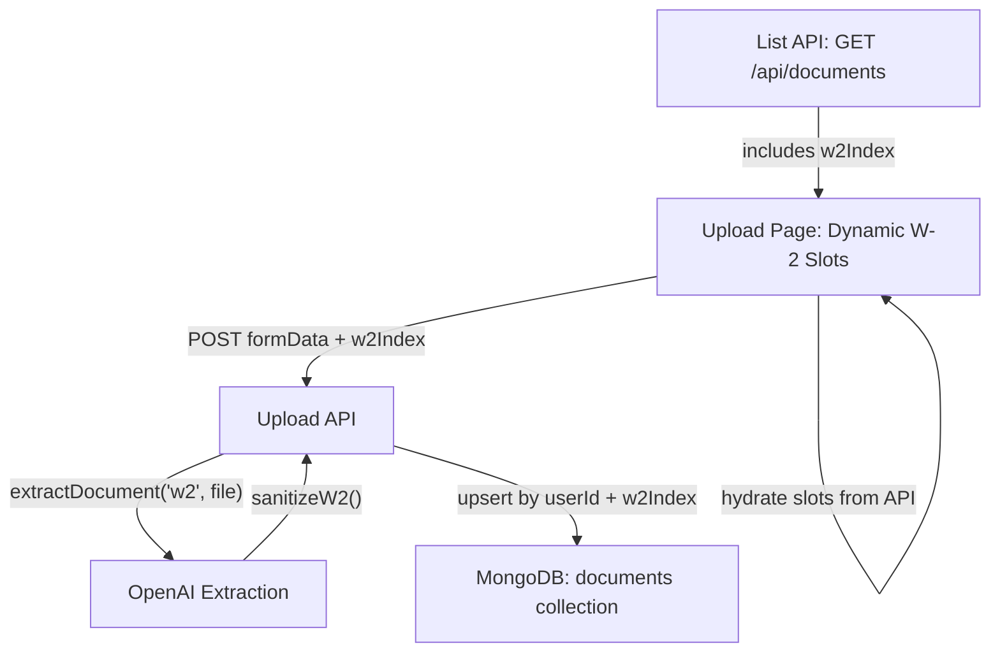

# Multiple W-2 Upload Support

## Scope

Upload + extraction + storage of multiple W-2 forms. A user uploads their first W-2 normally, then can click "Add W-2" to add additional W-2 slots. Each W-2 goes through the same extraction pipeline. Form filling from multiple W-2s is **out of scope** for now.

## Architecture




## Changes by File

### 1. Database Type -- [lib/types/document.ts](lib/types/document.ts)

Add an optional `w2Index` field to `StoredDocumentW2`:

```typescript
export type StoredDocumentW2 = {
  _id?: ObjectId;
  userId: ObjectId;
  documentType: "w2";
  w2Index?: number;  // 0-based: 0 = first, 1 = second, ...
  data: W2Extraction;
  originalFilename?: string;
  createdAt: Date;
};
```

Existing single-W2 documents without `w2Index` are implicitly index 0 (backward compatible).

### 2. Upload API -- [app/api/documents/upload/route.ts](app/api/documents/upload/route.ts)

- Parse an optional `w2Index` field from form data (default `0`).
- Include `w2Index` in the stored document.
- **Upsert** instead of `insertOne` for W-2: use `replaceOne({ userId, documentType: "w2", w2Index }, storedDoc, { upsert: true })` so re-uploading to the same slot replaces the old extraction cleanly.
- Non-W2 document types continue using `insertOne` (or their own upsert if already present -- currently they also just `insertOne`; keep consistent).

### 3. List Documents API -- [app/api/documents/route.ts](app/api/documents/route.ts)

- Add `w2Index` to the projection so the frontend knows which slot each W-2 belongs to.
- Update the `DocumentListItem` type to include `w2Index?: number`.

### 4. Upload Page UI -- [app/(app)/documents/upload/page.tsx](app/(app)/documents/upload/page.tsx)

This is the largest change. Key modifications:

**a) Dynamic W-2 slot state**

Replace the single static `"w2"` entry in `DOCUMENT_TYPES` with a dynamic slot system. Add state:

```typescript
const [w2SlotCount, setW2SlotCount] = useState(1);
```

Build the rendered card list by splicing W-2 slots into the static list at the W-2 position. Each slot gets an ID like `"w2"` (index 0), `"w2-1"` (index 1), `"w2-2"` (index 2).

**b) "Add W-2" card**

Render a special "Add W-2" card after the last W-2 slot. It uses the same `Card` visual but with a "+" icon and "Add W-2" title. On click:

- If the previous W-2 slot status is not `"done"`, show a toast: "Please upload the previous W-2 first."
- Otherwise, increment `w2SlotCount`.

**c) Dynamic labeling**

- `w2SlotCount === 1`: title is `"W2"` (unchanged)
- `w2SlotCount >= 2`: titles become `"W2 (First)"`, `"W2 (Second)"`, `"W2 (Third)"`, etc.

Use an ordinal word map: `["First", "Second", "Third", "Fourth", "Fifth"]`.

**d) File upload handler**

The existing `handleFileChange` works by `DocumentId`. Extend it so W-2 slot IDs (e.g. `"w2-1"`) are recognized and sent to the upload API with the correct `w2Index` appended to the form data.

**e) Required document check**

`allRequiredUploaded` must check that at least the first W-2 slot (`"w2"`) is done. Additional W-2 slots are not required for the Continue button.

**f) Hydration from GET /api/documents**

The `useEffect` that loads existing documents needs to:

- Count how many W-2 documents exist in the API response.
- Set `w2SlotCount` to that count (minimum 1).
- Populate `savedFilenames` and `uploadState` for each W-2 slot ID (`"w2"`, `"w2-1"`, etc.) based on `w2Index`.

**g) Reset handler**

The `documents:deleted` event handler resets `w2SlotCount` back to 1.

### 5. Form Fetch -- [lib/form-mappers/fetch-docs.ts](lib/form-mappers/fetch-docs.ts)

For **backward compatibility** (form filling deferred), keep `w2` as the primary/first W-2:

- Change `findOne({ userId, documentType: "w2" })` to `findOne({ userId, documentType: "w2" }, { sort: { w2Index: 1 } })` to deterministically get index 0.
- No other changes needed now. When form filling for multiple W-2s is implemented later, this will switch to `find().sort().toArray()`.

### 6. Eligibility Route -- [app/api/forms/eligibility/route.ts](app/api/forms/eligibility/route.ts)

The CA 540NR eligibility check (`ca_540nr`) currently uses a single W-2's `state_local`. Update to check **all** W-2 documents:

```typescript
const w2Docs = await documents
  .find({ userId, documentType: "w2" })
  .toArray() as StoredDocumentW2[];

ca_540nr: w2Docs.some((w2) =>
  (w2.data.state_local ?? []).some(
    (sl) => sl.state.toUpperCase() === "CA" && parseNum(sl.state_wages) > 0
  )
),
```

### 7. SSN Route -- [app/api/user/ssn/route.ts](app/api/user/ssn/route.ts)

Use `findOne` with `sort: { w2Index: 1 }` to consistently pick the first W-2 for SSN extraction. All W-2s belong to the same person so SSN should be identical, but we want deterministic behavior.

### 8. MongoDB Index -- [lib/mongodb.ts](lib/mongodb.ts)

Add a compound index for efficient upsert lookups:

```typescript
await coll.createIndex({ userId: 1, documentType: 1, w2Index: 1 });
```

## Edge Cases

- **Click "Add W-2" before uploading first**: toast with "Please upload your first W-2 before adding another"
- **Re-upload to same slot**: upsert replaces old document (no duplicates)
- **Only 1 W-2**: label stays "W2" with no ordinal
- **2+ W-2s**: labels retroactively become "W2 (First)", "W2 (Second)", etc.
- **Page reload**: hydration reconstructs correct slot count and states from API
- **Documents reset**: all W-2s deleted, slot count resets to 1
- **Legacy documents without w2Index**: treated as index 0 (backward compatible)

## Files NOT Changed

- `extraction/openai.ts` -- same extraction pipeline, no changes
- `extraction/prompts/forms/w2.ts` -- same schema/prompt, no changes
- `extraction/prompts/index.ts` -- no changes
- `app/api/documents/reset/route.ts` -- `deleteMany({ userId })` already deletes all W-2s
- `lib/form-mappers/types.ts` -- `w2: W2Extraction | null` stays as-is for now (deferred)
- All form mappers (`f1040nr.ts`, `f540nr.ts`, `f8843.ts`, `f1040nro.ts`) -- no changes (they use `docs.w2` which remains the first W-2)

