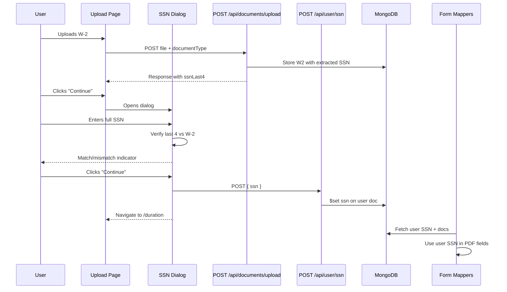

# SSN Prompt, Verification, and Storage

## Current State

- SSN is extracted from W-2 documents via AI (`extraction/prompts/forms/w2.ts`) and stored in `data.employee.ssn` in the `documents` collection.
- All 4 form mappers read SSN from `w2?.employee.ssn` and populate it into PDF fields:
  - [f8843.ts](lib/form-mappers/f8843.ts) -- `f1_06` (TIN)
  - [f1040nr.ts](lib/form-mappers/f1040nr.ts) -- `f1_16` (SSN/ITIN)
  - [f1040nro.ts](lib/form-mappers/f1040nro.ts) -- `f1_2` (SSN/ITIN)
  - [f540nr.ts](lib/form-mappers/f540nr.ts) -- `540NR_form_1006` (Your SSN)
- `UserDocument` ([lib/types/user.ts](lib/types/user.ts)) has no SSN field.
- The Upload Documents page ([page.tsx](app/(app)/documents/upload/page.tsx)) button "Continue with Uploaded Documents" just navigates to `/duration`.

## Changes

### 1. Add `ssn` field to `UserDocument`

In [lib/types/user.ts](lib/types/user.ts), add an optional `ssn?: string` field to `UserDocument`.

### 2. Create API route `POST /api/user/ssn`

New file: `app/api/user/ssn/route.ts`

- Accepts `{ ssn: string }` in the body
- Validates format (XXX-XX-XXXX, 9 digits)
- Saves `ssn` to the user's document in the `users` collection via `$set`
- Returns success

### 3. Create SSN prompt dialog component

New file: `components/ssn-dialog.tsx`

- A controlled `Dialog` (shadcn) with:
  - Title: "Enter your Social Security Number"
  - Description: "Your SSN is required for tax form filing and will not be auto-detected from uploaded documents."
  - An `Input` for SSN (masked input, format XXX-XX-XXXX)
  - If a W-2 has been uploaded, after user enters SSN, compare the last 4 digits of the entered SSN with the last 4 digits extracted from the W-2. Show a success/warning indicator:
    - Match: green check -- "Last 4 digits match your W-2"
    - Mismatch: warning -- "Last 4 digits do not match your W-2. Please verify."
  - Allow the user to proceed regardless (mismatch is a warning, not a blocker)
  - "Continue" button calls `POST /api/user/ssn`, then navigates to `/duration`

### 4. Wire dialog into Upload Documents page

In [app/(app)/documents/upload/page.tsx](app/(app)/documents/upload/page.tsx):

- When "Continue with Uploaded Documents" is clicked, open the SSN dialog instead of navigating immediately
- Pass relevant state: whether a W-2 was uploaded (check if `uploadState.w2?.status === "done"`)
- On successful SSN submission, navigate to `/duration`

To get the W-2's last 4 digits for verification, the upload API response could include the last 4 digits of extracted SSN (or we add a lightweight GET endpoint). Simplest: return `ssnLast4` in the upload response for W-2 documents only.

### 5. Update `FormDocuments` and form mappers to use user SSN

- Add `ssn: string | null` to `FormDocuments` in [lib/form-mappers/types.ts](lib/form-mappers/types.ts)
- In [lib/form-mappers/fetch-docs.ts](lib/form-mappers/fetch-docs.ts), also fetch the user's SSN from the `users` collection and include it in `FormDocuments`
- Update all 4 form mappers to use `docs.ssn` instead of `w2?.employee.ssn`:
  - `f8843.ts`: `v[...f1_06...] = docs.ssn ?? ""`
  - `f1040nr.ts`: `v[...f1_16...] = docs.ssn ?? ""`
  - `f1040nro.ts`: `v[...f1_2...] = docs.ssn ?? ""`
  - `f540nr.ts`: `v["540NR_form_1006"] = docs.ssn ?? ""`

### 6. Return `ssnLast4` from W-2 upload

In [app/api/documents/upload/route.ts](app/api/documents/upload/route.ts), when `docType === "w2"`, extract the last 4 characters from the SSN and include `ssnLast4` in the response JSON. The upload page will store this in state for the dialog's verification logic.

## Data Flow

