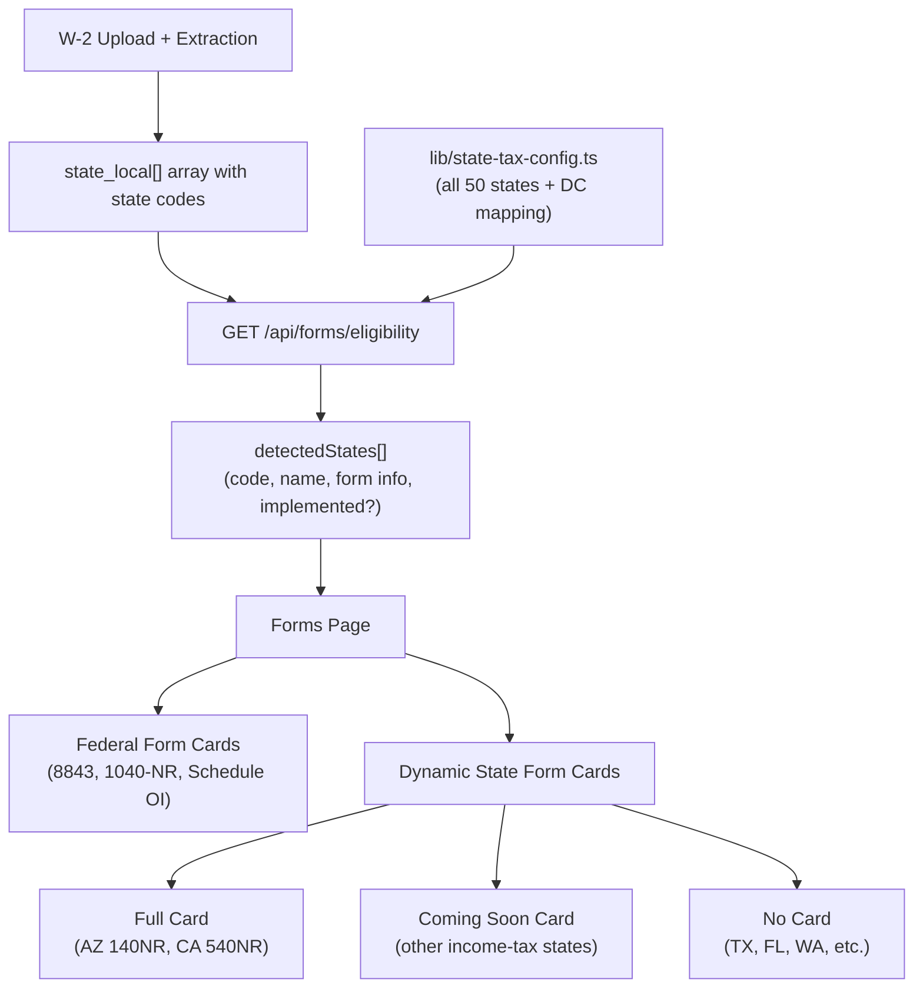

# State Tax Detection and Dynamic Form Rendering

## Current State

- W-2 extraction already captures `state_local[]` with `state` (2-letter code), `state_wages`, and `state_income_tax` fields
- Only California (540NR) is implemented as a state form, with a hardcoded `ca_540nr` boolean in `FormEligibility`
- The [forms page](app/(app)/forms/page.tsx) uses a static `FORMS` array with `visibleWhen` keys tied to `FormEligibility` booleans
- State detection is hardcoded: eligibility checks `state === "CA"` only

## Architecture




---

## 1. State Tax Configuration Map

Create `**[lib/state-tax-config.ts](lib/state-tax-config.ts)**` with a comprehensive lookup:

```typescript
export type StateTaxConfig = {
  code: string;             // "CA", "AZ", "TX", etc.
  name: string;             // "California", "Arizona", "Texas"
  hasIncomeTax: boolean;
  nonresidentForm: string | null;  // "Form 540NR" or null
  formId: string | null;           // registry key, e.g. "f540nr", "f140nr" — null if not implemented
  emptyFile: string | null;        // PDF filename: "540nr.pdf" — null if not implemented
  filledFilename: string | null;   // download name: "540nr_filled.pdf" — null if not implemented
  implemented: boolean;            // true = full fill experience, false = coming soon
};

export const STATE_TAX_MAP: Record<string, StateTaxConfig> = { ... };
```

- All 43 income-tax states + DC with their nonresident form names (from the user's reference list)
- 7 no-income-tax states (AK, FL, NV, SD, TN, TX, WA, WY) with `hasIncomeTax: false`
- New Hampshire as special case (`hasIncomeTax: false` for wages)
- `implemented: true` only for `CA` and `AZ`; all others `false`

---

## 2. Extend Eligibility API

Modify `**[app/api/forms/eligibility/route.ts](app/api/forms/eligibility/route.ts)**`:

- Keep `schedule_oi: boolean` as-is
- Replace `ca_540nr: boolean` with a new `detectedStates` array
- Logic: iterate all W-2s' `state_local` rows, collect unique state codes with positive `state_wages`, look each up in `STATE_TAX_MAP`, return the matching configs

```typescript
export type DetectedStateForm = {
  stateCode: string;
  stateName: string;
  hasIncomeTax: boolean;
  nonresidentForm: string | null;
  formId: string | null;
  emptyFile: string | null;
  filledFilename: string | null;
  implemented: boolean;
};

export type FormEligibility = {
  schedule_oi: boolean;
  detectedStates: DetectedStateForm[];
};
```

The detection logic:

1. Gather all `state_local[].state` values across all W-2s where `parseNum(state_wages) > 0`
2. Deduplicate to unique state codes
3. Look up each in `STATE_TAX_MAP`
4. Return the full `DetectedStateForm[]` (including no-income-tax states -- the frontend will decide not to render cards for those)

---

## 3. Update Forms Page for Dynamic State Cards

Modify `**[app/(app)/forms/page.tsx](app/(app)`/forms/page.tsx)**:

- **Remove** the CA 540NR entry from the static `FORMS` array (it will now come dynamically)
- Keep federal forms (8843, 1040-NR, Schedule OI) in the static array with `visibleWhen` for `schedule_oi`
- Add a **new section** below federal forms for state tax forms, generated from `eligibility.detectedStates`
- For each detected state with `hasIncomeTax: true`:
  - If `implemented: true` (CA, AZ): render a full card with View, Download Completed, Download Empty actions
  - If `implemented: false`: render a "Coming Soon" card with the state name and form name, but disabled fill/view actions. Possibly allow downloading the empty form if we have a URL pattern, or just show descriptive text.
- For states with `hasIncomeTax: false`: skip (no card rendered)
- Update `FormDef` type and `visibleWhen` to remove `ca_540nr` key since CA is now dynamic

Card design for "Coming Soon" states:

- Same card structure (Card, CardHeader, CardContent)
- Title: form name (e.g., "Form IT-201")
- Subtitle: state name + "Nonresident Income Tax Return"
- Description: "State income tax return for [State]. Auto-fill coming soon."
- Actions: all disabled or show a "Coming Soon" badge
- Visually subdued (e.g., `opacity-60` or a banner)

---

## 4. Arizona 140NR -- Full End-to-End

### 4a. PDF Template

- Source the Arizona Form 140NR blank PDF and place it at `public/forms/empty/az140nr.pdf`
- Run the existing `scripts/pdf-fields-to-json.ts` to dump AcroForm field names

### 4b. Tax Engine -- AZ Computation

Add to `**[lib/tax-engine.ts](lib/tax-engine.ts)`**:

- `AZ_BRACKETS_2025` (Arizona uses a flat 2.5% rate as of 2025)
- `AZ140NRComputation` type (AZ wages, AZ withholding, AZ taxable income, proration, tax, refund/owed)
- `computeAZ140NRTax(docs: FormDocuments)` function following the same pattern as `compute540NRTax`
- AZ is simpler than CA: flat 2.5% rate, standard deduction for single filers, no MHST equivalent

### 4c. Form Mapper

Create `**[lib/form-mappers/f140nr.ts](lib/form-mappers/f140nr.ts)`**:

- `mapToF140NR(docs: FormDocuments): Record<string, unknown>`
- Maps personal info, AZ wages, withholding, and computed tax to AcroForm field names
- Pattern follows `f540nr.ts`

### 4d. Form Registry

Add to `**[lib/forms/registry.ts](lib/forms/registry.ts)**`:

```typescript
{
  formId: "f140nr",
  pdfPath: "public/forms/empty/az140nr.pdf",
  filledFilename: "az140nr_filled.pdf",
  mapper: mapToF140NR,
  requiredDocTypes: ["passport", "w2"],
}
```

### 4e. State Config Entry

In `STATE_TAX_MAP`, Arizona gets `formId: "f140nr"` and `implemented: true`.

---

## 5. Migrate California to the New System

- Remove `ca_540nr` from the old `FormEligibility` type
- Remove the CA 540NR static entry from the `FORMS` array
- California's card will now render dynamically from `detectedStates` (with `implemented: true`)
- The existing `f540nr` registry entry, mapper, and tax engine remain unchanged
- Update any imports of `FormEligibility` that reference `ca_540nr`

---

## Key Files to Change


| File                                 | Change                                                |
| ------------------------------------ | ----------------------------------------------------- |
| `lib/state-tax-config.ts`            | **New** -- state tax mapping for all 50 states + DC   |
| `app/api/forms/eligibility/route.ts` | Replace `ca_540nr` with `detectedStates[]`            |
| `app/(app)/forms/page.tsx`           | Dynamic state form cards, remove CA from static array |
| `lib/tax-engine.ts`                  | Add AZ tax brackets + `computeAZ140NRTax`             |
| `lib/form-mappers/f140nr.ts`         | **New** -- AZ 140NR field mapper                      |
| `lib/forms/registry.ts`              | Add `f140nr` entry                                    |
| `public/forms/empty/az140nr.pdf`     | **New** -- blank AZ 140NR PDF template                |


