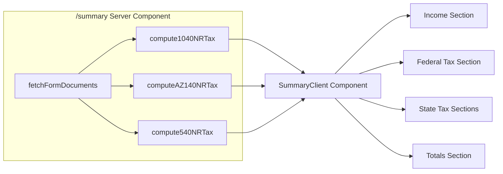

# Tax Summary Page

## Architecture

The summary page will be a **server-side rendered page** at `/summary` under the `(app)` route group. It will directly call the existing `fetchFormDocuments()` from `lib/form-mappers/fetch-docs.ts` (same pattern as the form fill endpoints), then run the pure tax engine functions (`compute1040NRTax`, `computeAZ140NRTax`, `compute540NRTax`) to produce all financial numbers. No new API route is needed — the page can call MongoDB directly as a server component.




## Data Available (no new DB queries needed)

All financial data is already extracted and stored in MongoDB. The existing `fetchFormDocuments()` loads everything, and the tax engine computes:

- **Income**: wages, SS tips, dependent care, allocated tips, other income, total income, AGI
- **Federal**: standard deduction, taxable income, tax computed, federal tax withheld, refund or amount owed
- **State (per detected state)**: state wages, state tax withheld, state tax computed, state refund or amount owed
- **W-2 details**: employer name, EIN — useful for showing "income from where"

## Files to Create / Modify

### 1. New page: `app/(app)/summary/page.tsx`

Server component that:

- Calls `fetchFormDocuments()` to get all docs from MongoDB
- Runs `compute1040NRTax(docs)` for federal numbers
- Detects states from W-2 `state_local` entries (same logic as eligibility route)
- Runs `computeAZ140NRTax(docs)` / `compute540NRTax(docs)` for each applicable state
- Passes all computed data as props to a client component for rendering

### 2. New component: `app/(app)/summary/summary-client.tsx`

Client component (`"use client"`) that renders the summary UI using shadcn `Card`, `Separator`, and `Table` components. Sections:

**A. Income Sources** — One row per W-2 employer showing employer name, wages, and federal tax withheld. A total row at the bottom.

**B. Federal Tax Summary (1040-NR)** — Key lines:

- Total Wages / Total Income / AGI
- Standard Deduction (if applicable, with treaty note for Indian nationals)
- Taxable Income
- Federal Tax
- Federal Tax Withheld (payments)
- **Refund** or **Amount Owed** (highlighted prominently)

**C. State Tax Summary** — One card per detected state with income tax, showing:

- State Wages
- State Tax Computed
- State Tax Withheld
- State Refund or Amount Owed

**D. Overall Totals** — Grand total card:

- Total tax owed across all jurisdictions
- Total tax withheld across all jurisdictions
- **Net refund** or **Net amount owed** (bold, color-coded: green for refund, red for owed)

### 3. Modify: `components/app-shell.tsx`

Add a **"Summary"** item to the sidebar, placed as a top-level nav item (same level as "Bank Details"), using a chart/document icon from `react-icons/hi` (e.g. `HiOutlineDocumentReport` or `HiOutlineChartBar`).

### 4. Modify: `middleware.ts`

Add `/summary` to `PROTECTED_PREFIXES` so unauthenticated users are redirected to login.

### 5. New utility: `lib/format-currency.ts`

A small shared helper for consistent USD formatting:

```typescript
export function formatUSD(n: number): string {
  return n.toLocaleString("en-US", {
    style: "currency",
    currency: "USD",
    minimumFractionDigits: 0,
    maximumFractionDigits: 0,
  });
}
```

## UI Design

- Minimalist, trustworthy layout using shadcn `Card` components
- `max-w-3xl` centered container (consistent with other pages)
- No emoji anywhere (per design rules)
- Monospaced, right-aligned numbers in tabular format for financial data
- Green text for refund amounts, red text for amounts owed
- Empty state card when no W-2 documents have been uploaded yet, with a link to the upload page

