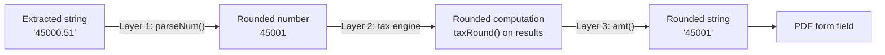

# Tax Value Rounding (Whole Dollar, 0.51 Threshold)

## Rounding Rule

- Fractional part **>= 0.51** --> round **UP** (e.g., $100.51 --> $101)
- Fractional part **< 0.51** --> round **DOWN** (e.g., $100.50 --> $100)
- Whole numbers pass through unchanged

This matches a conservative IRS-compatible rounding convention (standard IRS is 0.50; ours is slightly more conservative by rounding 0.50 down).

## Architecture: Defense-in-Depth

Three rounding layers so a missed round at one stage is caught at the next:




## Implementation

### 1. Add `taxRound()` utility to [lib/form-mappers/types.ts](lib/form-mappers/types.ts)

A single, well-tested pure function that all layers call:

```typescript
export function taxRound(n: number): number {
  if (!Number.isFinite(n) || n === 0) return 0;
  const cents = Math.round(n * 100);
  const wholeDollars = Math.trunc(cents / 100);
  const remainderCents = Math.abs(cents % 100);
  if (remainderCents === 0) return wholeDollars;
  if (cents > 0) {
    return remainderCents >= 51 ? wholeDollars + 1 : wholeDollars;
  }
  return remainderCents >= 51 ? wholeDollars - 1 : wholeDollars;
}
```

Key design decisions:

- Works in **integer cents** (`Math.round(n * 100)`) to avoid IEEE 754 floating-point comparison bugs (e.g., `1234.51 - 1234` = `0.5099...` in JS)
- Handles negative numbers correctly (rounds magnitude, preserves sign)
- Returns the input unchanged if already a whole number (zero remainder check)
- Handles `NaN`, `Infinity`, and `0` edge cases

### 2. Modify `parseNum()` in [lib/form-mappers/types.ts](lib/form-mappers/types.ts) -- Layer 1

This is the universal string-to-number gateway. Every extracted dollar value passes through here.

```typescript
export function parseNum(v: string | number | undefined | null): number {
  if (v === undefined || v === null || v === "") return 0;
  const n = typeof v === "number" ? v : Number(v);
  return Number.isFinite(n) ? taxRound(n) : 0;
}
```

Callers already using `parseNum`:

- [lib/tax-engine.ts](lib/tax-engine.ts) lines 127-132 (wages, tips, dep care, withheld, etc.)
- [lib/form-mappers/f540nr.ts](lib/form-mappers/f540nr.ts) lines 92-93 (CA wages, CA withholding)

### 3. Modify `amt()` in [lib/form-mappers/types.ts](lib/form-mappers/types.ts) -- Layer 3

The number-to-string gateway for PDF fields. Safety net if a raw number bypasses `parseNum`:

```typescript
export function amt(n: string | number | undefined | null): string {
  const num = taxRound(parseNum(n));
  return num ? String(num) : "";
}
```

Since `parseNum` already rounds, and sums of whole numbers stay whole, `taxRound` here will almost always be a no-op. But it catches any edge case where a non-rounded number reaches `amt` directly.

### 4. Modify `computeFederalTax()` in [lib/tax-engine.ts](lib/tax-engine.ts) -- Layer 2

Replace `Math.round(tax * 100) / 100` with `taxRound(tax)`:

```typescript
return taxRound(tax);
```

This is important because bracket math (`taxableInBracket * rate`) produces fractional results even when the input is a whole number.

### 5. Modify `compute1040NRTax()` in [lib/tax-engine.ts](lib/tax-engine.ts) -- Layer 2

Apply `taxRound` to all computed values before returning the `TaxComputation` object. The inputs (`wages`, `ssTips`, etc.) are already rounded via `parseNum`, but computed values like `totalWages`, `taxableIncome`, `balance`, etc. get an explicit round:

- `totalWages`, `totalIncome`, `agi` -- sums of rounded ints, so no-ops, but included for safety
- `taxableIncome` = `Math.max(0, agi - totalDeductions)` -- replace with `taxRound(Math.max(...))`
- `overpayment`, `amountOwed` -- replace `Math.round(... * 100) / 100` with `taxRound(...)`
- All returned fields get `taxRound()` applied

### 6. Files NOT modified (and why)

- `**normalizeAmount()` in [extraction/prompts/forms/w2.ts](extraction/prompts/forms/w2.ts)**: Only used for string comparison in `sanitizeW2` (detecting misplaced Box 12 values). Rounding here would break the comparison logic.
- `**daysInRange()` / `daysForYear()`**: These compute calendar days, not dollar amounts. They must not be rounded by `taxRound`.
- **MongoDB stored data**: Raw extraction strings are preserved as-is for auditability. Rounding is applied when values are consumed, not when stored.
- **f8843.ts, f1040nro.ts**: These mappers handle text/dates/days, not monetary values.

## Correctness Considerations

- **Floating-point safety**: Using `Math.round(n * 100)` converts to integer cents before comparison, avoiding JS floating-point comparison bugs like `1234.51 - 1234 = 0.5099...`
- **Idempotent**: `taxRound(taxRound(n)) === taxRound(n)` -- applying it multiple times is safe
- **Negative numbers**: Handled by rounding the magnitude and preserving the sign (relevant if any intermediate computation goes negative before clamping to 0)
- **Zero passthrough**: `taxRound(0) === 0`, no spurious non-zero values

