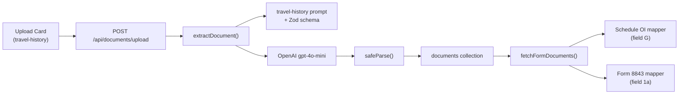

# Travel History Document Extraction

## Context

The I-94 Travel History page ([https://i94.cbp.dhs.gov/](https://i94.cbp.dhs.gov/)) produces a document with this structure:

```
Document Number: W9209895
Document Country of Issuance: India
Row  DATE        TYPE       LOCATION
1    2026-01-22  Arrival    SFR
2    2026-01-01  Departure  SFR
3    2024-08-10  Arrival    SFR
```

The upload page already has a `"travel-history"` card in `[app/(app)/documents/upload/page.tsx](app/(app)`/documents/upload/page.tsx) but it is not wired to any extraction. The dev guide at `[DEV_GUIDES/ADDING_DOCUMENT_TYPES.md](DEV_GUIDES/ADDING_DOCUMENT_TYPES.md)` outlines the exact steps.

## Architecture




## Step 1: Create extraction module

**New file:** `extraction/prompts/documents/travel-history.ts`

Following the pattern from `[extraction/prompts/documents/passport.ts](extraction/prompts/documents/passport.ts)`:

- **Zod schema** (`travelHistorySchema`):
  - `document_number: z.string()` (e.g. "W9209895")
  - `document_country_of_issuance: z.string()` (e.g. "India")
  - `records: z.array(recordSchema)` where each record has:
    - `date: z.string()` (YYYY-MM-DD)
    - `type: z.string()` ("Arrival" or "Departure")
    - `location: z.string()` (port code, e.g. "SFR")
- **Export type:** `TravelHistoryExtraction = z.infer<typeof travelHistorySchema>`
- **Prompt:** Instruct the model to extract the document number, country, and all rows from the travel history table. Dates in YYYY-MM-DD format. Use "" for missing fields.
- **JSON schema** (`travelHistoryJsonSchema`): matching object with `additionalProperties: false`

## Step 2: Register in prompt registry

**File:** `[extraction/prompts/index.ts](extraction/prompts/index.ts)`

- Import `travelHistorySchema`, `travelHistoryPrompt`, `travelHistoryJsonSchema` from `./documents/travel-history`
- Export the type: `export type { TravelHistoryExtraction } from "./documents/travel-history"`
- Add `"travel-history": { prompt, schema, jsonSchema }` to the `registry` object
- Add `"travel-history"` to `SUPPORTED_DOCUMENT_TYPES` array

## Step 3: Add stored document type

**File:** `[lib/types/document.ts](lib/types/document.ts)`

- Import `TravelHistoryExtraction` from `@/extraction/prompts`
- Add `StoredDocumentTravelHistory` type (matching the passport pattern)
- Add it to the `StoredDocument` union

## Step 4: Add to FormDocuments and fetch pipeline

**File:** `[lib/form-mappers/types.ts](lib/form-mappers/types.ts)`

- Import `TravelHistoryExtraction` from `@/extraction/prompts`
- Add `travelHistory: TravelHistoryExtraction | null` to `FormDocuments`

**File:** `[lib/form-mappers/fetch-docs.ts](lib/form-mappers/fetch-docs.ts)`

- Import `StoredDocumentTravelHistory`
- Add `coll.findOne({ userId, documentType: "travel-history" })` to the `Promise.all`
- Map result into `travelHistory: travelHistoryDoc?.data ?? null`

## Step 5: Handle in upload API

**File:** `[app/api/documents/upload/route.ts](app/api/documents/upload/route.ts)`

- Import `TravelHistoryExtraction` from `@/extraction/prompts` and `StoredDocumentTravelHistory` from document types
- Add a branch in the `storedDoc` builder for `docType === "travel-history"`

## Step 6: Update upload UI -- tooltip

**File:** `[app/(app)/documents/upload/page.tsx](app/(app)`/documents/upload/page.tsx)

- The `"travel-history"` card already exists. It will now work automatically because `SUPPORTED_DOCUMENT_TYPES` includes it after Step 2.
- Add a tooltip (or a small info icon with popover) on the Travel History card description with text like: "You can get your travel history at i94.cbp.dhs.gov" linking to `https://i94.cbp.dhs.gov/`. Use a Lucide `Info` icon or `HiOutlineInformationCircle` and a shadcn Tooltip or Popover component, keeping it minimalist.

## Step 7: Consume in form mappers

### Schedule OI field G -- `[lib/form-mappers/f1040nro.ts](lib/form-mappers/f1040nro.ts)`

Currently field G uses `duration` data (arrival/departure per year). With travel history, we get the actual dates. The mapper should:

- If `travelHistory` is available, derive entry/departure date pairs from `records` (sorted by date descending). Pair each Arrival with the next Departure to fill LineG_Table1 rows (up to 8 date slots in 4 rows on the left side, plus 4 rows on the right side = 8 total entry/departure pairs).
- Fall back to the existing `duration`-based logic when travel history is not available.

The "Canada or Mexico" checkbox can remain unfilled (default).

### Form 8843 field 1a -- `[lib/form-mappers/f8843.ts](lib/form-mappers/f8843.ts)`

Field `f1_09` currently uses `docs.f1VisaEntryDate`. Enhance it:

- If `travelHistory` is available, find the most recent Arrival record and use its date as the entry date (when `f1VisaEntryDate` is not manually set).
- This provides an automatic fallback so users don't have to manually enter their entry date in the Additional Information dialog.

