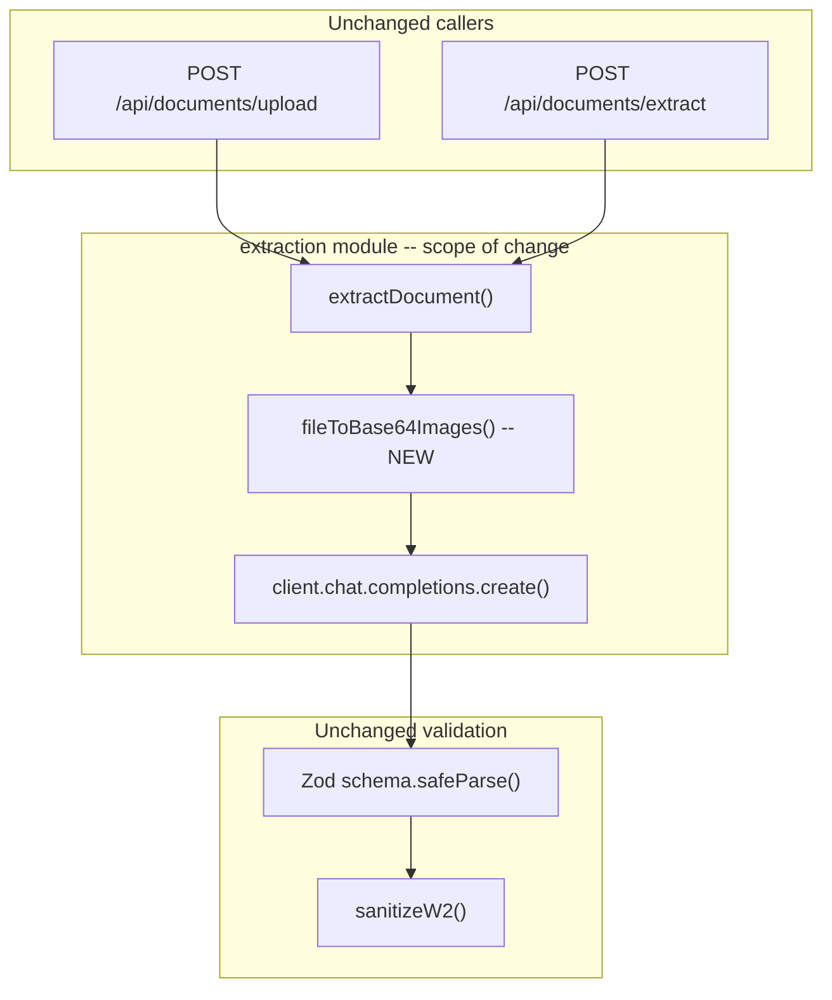

# Refactor Extraction to Chat Completions + Vision

## Motivation

The current extraction pipeline uses OpenAI's **Files API** (`client.files.create`) and **Responses API** (`client.responses.create`) -- both are OpenAI-proprietary endpoints that the genOS adapter does not support. Switching to **Chat Completions + Vision** enables provider-agnostic extraction through any OpenAI-compatible endpoint (genOS, direct OpenAI, Azure, etc.) while maintaining the same accuracy and reliability guarantees.

## Scope

The change is **fully contained** within the `extraction/` module. No callers change -- `extractDocument()` keeps its existing signature.




## Current vs. Proposed Flow

**Current** (`extraction/openai.ts` lines 89-139):

1. `uploadFile()` -- sends file to OpenAI Files API, gets `file_id`
2. `client.responses.create()` -- sends `file_id` + prompt + JSON schema via Responses API
3. Parse JSON, validate with Zod, optional `sanitizeW2()`

**Proposed:**

1. `fileToBase64Images()` -- converts file to base64 image(s) locally (images pass through; PDFs are rendered page-by-page)
2. `client.chat.completions.create()` -- sends base64 images + prompt + JSON schema via Chat Completions API
3. Parse JSON, validate with Zod, optional `sanitizeW2()` (unchanged)

## Pre-implementation test results (PASSED)

Three tests were run against the live genOS adapter on localhost:5000. All passed.

**Test 1 -- json_schema (text-only):** `gpt-4o-mini` with `response_format: json_schema` returned `{"capital":"Paris"}`. PASSED.

**Test 2 -- Vision models require `-vision` suffix:** Sending image content to `gpt-4o-mini`, `gpt-4.1`, or `gemini-2.5-flash` returns `"image or doc content type is not allowed for non-vision models"`. GenOS docs (howto.md line 321) confirm: *"Model ending with -vision allows you to access the image modality."* Text-only models work fine for text; vision requires the suffix.

**Test 3 -- Vision + json_schema with real W2:** Sent the actual `W2_Mustafa_Saifee_AZ_2025.pdf` (converted to JPEG) to model `gpt-4o-mini-2024-07-18-oai-vision` with a structured output schema. Response: `{"employer_name":"Intuit Inc.","employee_name":"Mustafa"}` in 3.3 seconds, 25k prompt tokens. PASSED.

**Critical design implication:** The `getModel()` function needs awareness of two model contexts:

- **Text-only calls (not used here, but for future reference):** Standard model names work (e.g., `gpt-4o-mini` maps to `gpt-4o-mini-2024-07-18-oai`).
- **Vision calls (extraction):** GenOS requires the `-vision` suffix appended to the GenOS model ID (e.g., `gpt-4o-mini-2024-07-18-oai-vision`). Direct OpenAI does NOT need a suffix -- the same model handles both modalities.

**Solution:** Add a new env var `OPENAI_VISION_MODEL` that defaults to `gpt-4o-mini` for direct OpenAI but can be set to the genOS vision model ID (e.g., `gpt-4o-mini-2024-07-18-oai-vision`) when using genOS. This keeps the model name explicit and avoids fragile suffix-appending logic. The existing `OPENAI_EXTRACTION_MODEL` env var is renamed/repurposed to `OPENAI_VISION_MODEL` for clarity (since extraction now always uses vision).

## Detailed Changes

### 1. Add dependency: `pdf-to-img`

- **Why:** PDFs must be converted to images for vision input. The Chat Completions API accepts images (base64 data URIs) but not raw PDF bytes.
- **Library:** `[pdf-to-img](https://www.npmjs.com/package/pdf-to-img)` -- wrapper around `pdfjs-dist` that renders each PDF page to a PNG buffer.
- **Install:** `npm install pdf-to-img`
- **Used server-side only** (API routes), does not affect client bundle.

**Bundling concern:** `pdfjs-dist` (pulled in by `pdf-to-img`) is ~10 MB and may require a canvas polyfill in Node.js serverless environments. To prevent Next.js from trying to bundle it into serverless functions (which have a 50 MB limit on Vercel), add it to `serverExternalPackages` in `next.config.ts`:

```typescript
const nextConfig = {
  serverExternalPackages: ["pdf-to-img"],
};
```

This tells Next.js to leave the package as a Node.js require instead of bundling it. Verify this works during the build step.

### 2. New file: `extraction/pdf-to-images.ts`

Responsible for converting any uploaded file (image or PDF) into one or more base64-encoded images suitable for the vision API.

**Type:**

```typescript
type Base64Image = {
  mimeType: string;  // e.g. "image/png", "image/jpeg"
  base64: string;    // raw base64 string (no data: prefix)
};
```

**MIME detection strategy (addresses Buffer inputs):**

`File` and `Blob` carry a `.type` property, but `Buffer` has no inherent MIME type. The caller (`extractDocument`) passes through what it knows, but for robustness, `fileToBase64Images` uses a two-tier approach:

1. **Trust the caller's hint** if a MIME type is provided (from `File.type` or the route's Content-Type).
2. **Magic-byte sniffing as fallback** when MIME is missing or `application/octet-stream`. Check the first bytes of the buffer:
  - `%PDF` (hex `25 50 44 46`) at offset 0 --> PDF
  - `FF D8 FF` --> JPEG
  - `89 50 4E 47` --> PNG
  - `47 49 46 38` --> GIF
  - `52 49 46 46` ... `57 45 42 50` --> WEBP
  - Anything else --> treat as PDF (the most common upload type; `pdf-to-img` will throw a clear error if it's not a valid PDF)

This is implemented as a small `detectMimeType(buffer)` helper inside the same file (~15 lines). No external dependency needed -- just byte comparisons.

**Logic:**

- If resolved MIME starts with `image/` -- read the buffer, base64-encode it, return a single-element array
- If resolved MIME is `application/pdf` -- use `pdf-to-img` to render each page as PNG at `scale: 2.0`, return array of base64 images
- **Password-protected PDFs:** `pdf-to-img` throws when it encounters encrypted PDFs (common with employer-generated W-2s). Catch this specifically and throw an `ExtractionError` with code `"api"` and a user-friendly message: `"This PDF appears to be password-protected. Please remove the password and re-upload."` -- detect by checking `err.message` for "password" or "encrypted" keywords.
- **Zero pages:** Throw `ExtractionError` with code `"api"` and message `"The PDF has no renderable pages."`
- **General failure:** Wrap all conversion in try/catch; any unrecognized error becomes `ExtractionError` code `"api"` with `"Failed to process the document for extraction."`

**Scale factor rationale:** `scale: 2.0` produces ~150-200 DPI images from standard PDFs. This balances accuracy (text remains sharp and legible) against token cost. The OpenAI `detail: "high"` setting further processes images into tiles for fine-grained text recognition.

**File size consideration:** A typical 1-page W-2 at 2x scale produces ~200-400 KB PNG. Base64 encoding inflates this ~33%, yielding ~300-530 KB per page. A 2-page I-20 would be ~600 KB-1 MB total. Well within API payload limits.

### 3. Rewrite: `extraction/openai.ts`

This is the core change. The file structure stays similar but the API call path changes completely.

**Remove:**

- `uploadFile()` function (entire function, lines 27-50) -- no longer needed since we don't use the Files API

**Modify `getClient()`:**

- Add support for `OPENAI_BASE_URL` env var so the same code can target genOS or direct OpenAI:

```typescript
function getClient(): OpenAI {
  const key = process.env.OPENAI_API_KEY;
  if (!key?.trim()) {
    throw new Error("OPENAI_API_KEY is not set.");
  }
  return new OpenAI({
    apiKey: key,
    baseURL: process.env.OPENAI_BASE_URL?.trim() || undefined,
    maxRetries: 3,
    timeout: 120_000,  // Increased from 60s: vision processing is slower
  });
}
```

**Rewrite `extractDocument()`:**

The function signature stays identical: `(documentType: string, file: File | Blob | Buffer, filename?: string) => Promise<unknown>`

New internal flow:

1. Validate `documentType` and load prompt config (unchanged)
2. Call `fileToBase64Images(file, mime)` to get base64 images
3. Build Chat Completions message with vision content parts:

```typescript
const content: OpenAI.Chat.ChatCompletionContentPart[] = [
  ...images.map((img) => ({
    type: "image_url" as const,
    image_url: {
      url: `data:${img.mimeType};base64,${img.base64}`,
      detail: "high" as const,
    },
  })),
  { type: "text" as const, text: config.prompt },
];
```

1. Call `client.chat.completions.create()` with structured output:

```typescript
// max_tokens is a ceiling, not an expectation. Actual output ranges from
// ~200 tokens (travel-history) to ~1500 tokens (I-20). 4096 provides safe
// headroom for all document types without risking truncation.
const response = await client.chat.completions.create({
  model,
  messages: [{ role: "user", content }],
  response_format: {
    type: "json_schema",
    json_schema: {
      name: `extract_${documentType}`,
      schema: config.jsonSchema as Record<string, unknown>,
      strict: true,
    },
  },
  max_tokens: 4096,
});
```

1. Extract response text from `response.choices[0]?.message?.content` (different path than Responses API's `response.output_text`)
2. JSON parse and Zod validate (unchanged)
3. W-2 sanitization (unchanged)

**Error handling:**

- Image conversion failure: `ExtractionError` with code `"api"`
- API call failure: same wrapping logic as current (network errors get code `"api"`)
- Empty response: `ExtractionError` with code `"api"`
- JSON parse failure: `ExtractionError` with code `"parse"`
- Zod validation failure: `ExtractionError` with code `"validation"`
- All error codes remain the same so callers' switch/if logic is unaffected

`**ExtractionError` class:** No changes needed. Same codes, same class.

### 4. Schema compatibility -- no changes needed

All four JSON schemas (`[passportJsonSchema](extraction/prompts/documents/passport.ts)`, `[w2JsonSchema](extraction/prompts/forms/w2.ts)`, `[i20JsonSchema](extraction/prompts/documents/i20.ts)`, `[travelHistoryJsonSchema](extraction/prompts/documents/travel-history.ts)`) already satisfy the requirements for Chat Completions structured output:

- Root type is `"object"`
- Every object has `additionalProperties: false`
- All fields listed in `required` arrays
- No unsupported JSON Schema keywords

The `response_format.json_schema` wrapper in Chat Completions uses `{ name, schema, strict }` vs. the Responses API's `text.format` with `{ type, name, schema, strict }` -- but the inner `schema` object is identical.

### 5. Prompt files -- no changes needed

The prompts already say "image or PDF" and describe what to extract. Since the model now sees images (even for PDFs), the prompts remain accurate. No adjustment needed.

### 6. Environment variables


| Variable                  | Status             | Purpose                                                                                                                                                     |
| ------------------------- | ------------------ | ----------------------------------------------------------------------------------------------------------------------------------------------------------- |
| `OPENAI_API_KEY`          | Existing, required | API key (direct OpenAI) or any string (genOS adapter)                                                                                                       |
| `OPENAI_EXTRACTION_MODEL` | Existing, optional | Model name for extraction. Default: `gpt-4o-mini` (works for direct OpenAI). For genOS, set to the vision variant e.g. `gpt-4o-mini-2024-07-18-oai-vision`. |
| `OPENAI_BASE_URL`         | **New, optional**  | Base URL for the API. Omit for direct OpenAI. Set to genOS adapter URL (e.g. `http://localhost:5000/v1`) to use genOS.                                      |


**genOS setup example** (`.env`):

```
OPENAI_API_KEY=anything
OPENAI_BASE_URL=http://localhost:5000/v1
OPENAI_EXTRACTION_MODEL=gpt-4o-mini-2024-07-18-oai-vision
```

**Direct OpenAI setup example** (`.env`):

```
OPENAI_API_KEY=sk-...
# OPENAI_BASE_URL omitted -- defaults to api.openai.com
# OPENAI_EXTRACTION_MODEL omitted -- defaults to gpt-4o-mini
```

### 7. Update documentation: `docs/OPENAI_EXTRACTION.md`

Update the doc to reflect:

- APIs used: Chat Completions API (was Files + Responses)
- New env var: `OPENAI_BASE_URL`
- Provider flexibility: works with OpenAI, genOS, or any compatible endpoint
- Remove references to Files API

## Files Changed Summary


| File                                                     | Action                       | Lines (approx)                                                  |
| -------------------------------------------------------- | ---------------------------- | --------------------------------------------------------------- |
| `[extraction/openai.ts](extraction/openai.ts)`           | Rewrite                      | ~110 (was ~164)                                                 |
| `extraction/pdf-to-images.ts`                            | **New**                      | ~65 (includes MIME detection + password-protected PDF handling) |
| `[docs/OPENAI_EXTRACTION.md](docs/OPENAI_EXTRACTION.md)` | Update                       | ~44                                                             |
| `package.json`                                           | Add `pdf-to-img` dep         | 1 line                                                          |
| `[next.config.ts](next.config.ts)`                       | Add `serverExternalPackages` | ~3 lines                                                        |


## Files NOT Changed (zero-touch guarantee)

- All prompt files (`extraction/prompts/`**) -- schemas and prompts unchanged
- All callers (`app/api/documents/upload/route.ts`, `app/api/documents/extract/route.ts`)
- All form mappers (`lib/form-mappers/`**)
- All types (`lib/types/`**, `lib/form-mappers/types.ts`)
- PDF fill logic (`lib/pdf.ts`)

## Accuracy and Reliability Safeguards

1. **Structured output with `strict: true`** -- Chat Completions enforces the JSON schema at the API level, same as the Responses API did. The model is constrained to produce valid JSON matching the schema.
2. **Zod validation preserved** -- Every response is still parsed and validated through the same Zod schemas. Any schema mismatch is caught and returned as a `"validation"` error.
3. `**sanitizeW2()` preserved** -- The post-extraction guard that fixes Box 10/Box 12 confusion continues to run for W-2 extractions.
4. **High-detail vision** -- All document images use `detail: "high"` for maximum OCR accuracy. This tells the model to process images at full resolution with tiling. This is a deliberate choice -- live testing showed ~25k prompt tokens for a 1-page W-2, which is acceptable. `detail: "high"` is the best available setting for precise text extraction from tax documents.
5. **2x scale PDF rendering** -- PDFs are rendered at 2x scale (~150-200 DPI) to ensure text is crisp and readable by the vision model.
6. **Increased timeout** -- 120 seconds (up from 60) to account for vision processing latency with multi-page documents.
7. **Retry logic** -- `maxRetries: 3` on the OpenAI client handles transient network failures.

## Risk Assessment


| Risk                                                    | Mitigation                                                                                                                                                                                                                                                                  |
| ------------------------------------------------------- | --------------------------------------------------------------------------------------------------------------------------------------------------------------------------------------------------------------------------------------------------------------------------- |
| Password-protected / encrypted PDFs                     | Catch `pdf-to-img` errors, check message for "password" / "encrypted" keywords, return user-facing message: "This PDF appears to be password-protected. Please remove the password and re-upload." Falls back to generic "Failed to process document" for other PDF errors. |
| genOS does not support `response_format: json_schema`   | **RESOLVED -- pre-flight test passed.** json_schema with strict:true works through genOS adapter.                                                                                                                                                                           |
| genOS rejects vision content on standard model names    | **RESOLVED -- pre-flight test identified.** GenOS requires `-vision` suffix on model IDs for image input. Handled via `OPENAI_EXTRACTION_MODEL` env var (user sets the vision model ID explicitly for genOS).                                                               |
| `pdf-to-img` / `pdfjs-dist` bundle too large for Vercel | `serverExternalPackages` in `next.config.ts` excludes it from bundling. Verified during `npm run build` step.                                                                                                                                                               |
| Buffer inputs with no MIME type                         | Magic-byte sniffing detects PDF/JPEG/PNG/GIF/WEBP from first bytes. Unknown formats default to PDF path (which fails fast and clearly if not a valid PDF).                                                                                                                  |
| Large base64 payloads for multi-page PDFs               | 2-page I-20 at 2x scale is ~1 MB base64. Well within typical API limits. Can reduce scale to 1.5x if needed.                                                                                                                                                                |
| Vision accuracy differs from Files+Responses            | Both use the same underlying model (GPT-4o-mini). Vision mode on document images is the same OCR pipeline. Structured output constraint is identical.                                                                                                                       |


## Out of scope / Future improvements

**GenOS adapter: add `-vision` aliases to `from_common_name()`**

Currently callers must pass the full versioned GenOS model ID to use vision (e.g., `gpt-4o-mini-2024-07-18-oai-vision`). This ID is version-pinned -- if Intuit upgrades the model version, any hardcoded references break silently. The fix is a 10-minute change in `import-genos-as-openai-cortex/genos_adapter.py`: add `-vision` variants to the `from_common_name()` mapping (e.g., `"gpt-4o-mini-vision"` → `"gpt-4o-mini-2024-07-18-oai-vision"`). This is an adapter team task, not blocking this refactor, but worth flagging to them so `OPENAI_EXTRACTION_MODEL=gpt-4o-mini-vision` can eventually replace the version-pinned ID.
